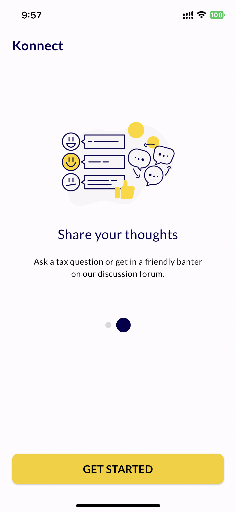
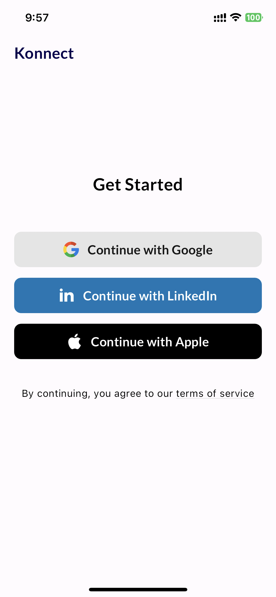

# konnect

A new Flutter project.

## Here is the two screens coded and implemented in Flutter.

- How to use pixel perfect design.
- Easy tool for designers to check and navigate into your design code.

  
  

